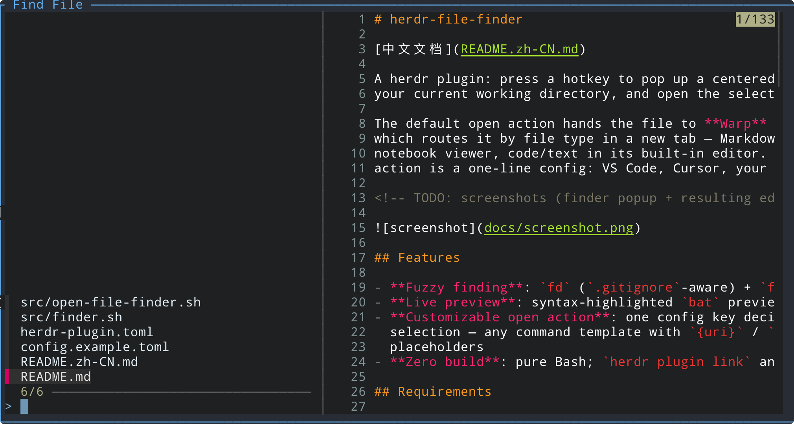

# herdr-file-finder

[中文文档](README.zh-CN.md)

A herdr plugin: press a hotkey to pop up a centered fuzzy file finder rooted at
your current working directory, and open the selection however you like.

The default open action hands the file to **Warp** (the author's terminal),
which routes it by file type in a new tab — Markdown in Warp's rendered
notebook viewer, code/text in its built-in editor. Everything about the open
action is a one-line config: VS Code, Cursor, your `$EDITOR`, any command.



## Features

- **Fuzzy finding**: `fd` (`.gitignore`-aware) + `fzf` — filter as you type
- **Live preview**: syntax-highlighted `bat` preview of the selected file
- **Customizable open action**: one config key decides what happens on
  selection — any command template with `{uri}` / `{path}` / `{dir}`
  placeholders
- **Zero build**: pure Bash; `herdr plugin link` and you're done

## Requirements

```bash
brew install fd fzf jq bat
```

`bat` is only used for previews (falls back to `cat` if missing); the other
three are required.

## Installation

```bash
# 1. Link the plugin into herdr (a link, not a copy — edits take effect immediately)
herdr plugin link /path/to/herdr-file-finder
```

2. Bind a hotkey in `~/.config/herdr/config.toml` (append):

```toml
[[keys.command]]              # fuzzy-find a file, open it in a new Warp tab
key = "prefix+o"
type = "shell"
command = "herdr plugin action invoke find-file --plugin herdr-file-finder"
```

Verify: `herdr plugin list` should show `herdr-file-finder … enabled`.

## Usage

| Key | Action |
| --- | --- |
| `prefix+o` | Open the finder popup (rooted at the focused pane's cwd) |
| type characters | Fuzzy-filter the file list |
| `↑` / `↓` | Move the selection |
| `Enter` | Open the selected file (via the configured action) |
| `Esc` | Dismiss the popup |

## Configuration

Optional config file:
`~/.config/herdr/plugins/config/herdr-file-finder/config.toml`
(run `herdr plugin config-dir herdr-file-finder` to print the directory). See
[`config.example.toml`](config.example.toml) for the full annotated list.

### Custom open action

A single `open` key whose value is a command template (run via `bash -c` on
selection). With no config file, the default template opens the file in a new
Warp tab:

```toml
open = 'open "warp://action/new_tab?path={uri}"'
```

Placeholders:

| Placeholder | Meaning |
| --- | --- |
| `{uri}` | Percent-encoded absolute path (for `warp://` URIs) |
| `{path}` | Raw absolute path (quote it yourself: `"{path}"`) |
| `{dir}` | Containing directory of the selected file |

Common templates:

```toml
# Warp: new tab (Markdown → rendered viewer, code → built-in editor) — default
open = 'open "warp://action/new_tab?path={uri}"'

# Warp: built-in editor directly (supports an optional &line=N jump)
open = 'open "warp://action/open_file_editor?path={uri}"'

# VS Code / Cursor
open = 'code "{path}"'
open = 'cursor "{path}"'

# macOS default app for the file type
open = 'open "{path}"'
```

TOML single-quoted literal strings are recommended (templates contain double
quotes themselves); double-quoted form with `\"` escapes also works.

### Other tweaks (edit `src/`)

- **Popup size**: `--width 70% --height 60%` in `src/open-file-finder.sh`
- **Preview pane ratio**: `--preview-window 'right,60%,border-left'` in
  `src/finder.sh`
- **Include hidden files**: add `--hidden --exclude .git` to `fd` in
  `src/finder.sh`

## How it works

1. `prefix+o` → herdr action `find-file` → `src/open-file-finder.sh`
2. The launcher reads the focused pane's cwd from `HERDR_PLUGIN_CONTEXT_JSON`
   and opens the `file-finder` entrypoint as a focused popup (70%×60%, centered)
3. Inside the popup, `src/finder.sh` pipes `fd --type f` into `fzf`;
   `Esc` or an empty selection just exits and herdr auto-closes the popup
4. On selection the absolute path is percent-encoded (`jq @uri`), substituted
   into the `open` template and executed. The default template calls Warp's
   `warp://action/new_tab` URI, which routes by file type: Markdown → notebook
   viewer, code/text → built-in editor, directory → terminal session

## Uninstall

```bash
herdr plugin unlink herdr-file-finder
# also remove the [[keys.command]] binding from ~/.config/herdr/config.toml
```
